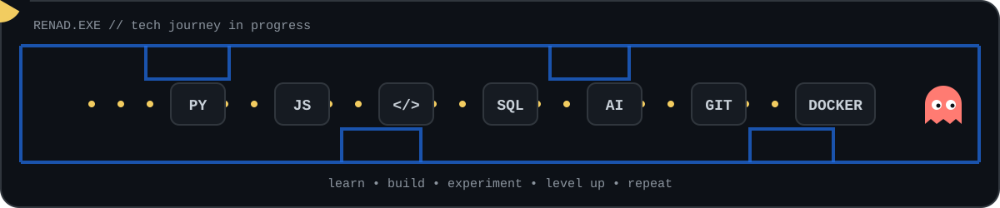

<!-- ===================================================== -->
<!--                    TERMINAL HERO                      -->
<!-- ===================================================== -->

  

<!-- ===================================================== -->
<!--                      ABOUT ME                         -->
<!-- ===================================================== -->

<h2 align="center">👩‍💻 About Me</h2>

  Hi! I'm <b>Renad</b> — a Computer Science & Artificial Intelligence student
  who enjoys turning ideas into real digital experiences.
    
  I'm interested in artificial intelligence, software development,
  data-driven solutions, and building projects that grow with every new skill I learn.

<!-- ===================================================== -->
<!--                     TECH STACK                        -->
<!-- ===================================================== -->

<h2 align="center">🛠️ Tech Stack</h2>

  

<!-- ===================================================== -->
<!--                  PAC-MAN TECH WORLD                   -->
<!-- ===================================================== -->

<h2 align="center">👾 Leveling Up...</h2>

  

  <i>Every technology is another level unlocked.</i> 🎮

<!-- ===================================================== -->
<!--                  FEATURED PROJECTS                    -->
<!-- ===================================================== -->

<h2 align="center">🚀 Featured Projects</h2>

<table align="center">
<tr>

<td width="50%" valign="top">

<h3>🌐 Volunteer Teams Web Platform</h3>

A reusable web platform designed for volunteer teams,
allowing multiple teams to launch customized websites
from a scalable and reusable structure.

<b>Built with:</b>

 

WordPress • Docker • MySQL • HTML • CSS

  

<i>Repository coming soon...</i>

</td>

<td width="50%" valign="top">

<h3>🤖 Next Build...</h3>

Currently exploring new ideas and building projects
across AI, software development, and intelligent digital experiences.

<b>Status:</b>

 

<code>building...</code>

  

<i>More projects coming soon.</i>

</td>

</tr>
</table>

<!-- ===================================================== -->
<!--                 CURRENTLY LEARNING                    -->
<!-- ===================================================== -->

<h2 align="center">🌱 Currently Learning</h2>

🤖 Artificial Intelligence
&nbsp;&nbsp;•&nbsp;&nbsp;
💻 Software Development
&nbsp;&nbsp;•&nbsp;&nbsp;
📊 Data & Intelligent Solutions

  

Always experimenting, learning, and turning new concepts into projects.

<!-- ===================================================== -->
<!--                     FUTURE                            -->
<!-- ===================================================== -->

<h2 align="center">🎯 What's Next?</h2>

Build useful products. 
Explore smarter AI solutions. 
Turn more ideas into real projects. 
Keep learning, creating, and evolving.

  

<b>This world is still under construction.</b> 🚧

<!-- ===================================================== -->
<!--                    GITHUB STATS                       -->
<!-- ===================================================== -->

<h2 align="center">💻 GitHub Terminal</h2>

  

<!-- ===================================================== -->
<!--                    CONNECT                            -->
<!-- ===================================================== -->

<h2 align="center">🌐 Connect With Me</h2>

 <a href="https://www.linkedin.com/in/renad-alharbi-ab0683281?utm_source=share&utm_campaign=share_via&utm_content=profile&utm_medium=ios_app">
    LinkedIn
  </a>

 

<code>&lt;/ keep building &gt;</code>

  

<b>Learn • Build • Experiment • Evolve</b> 🚀

